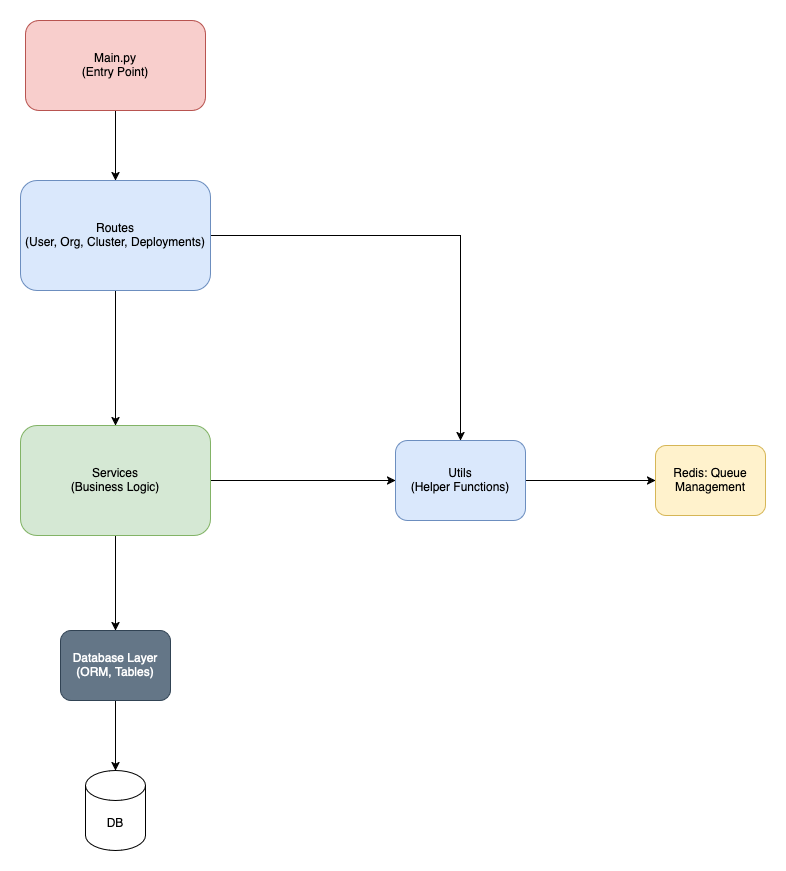
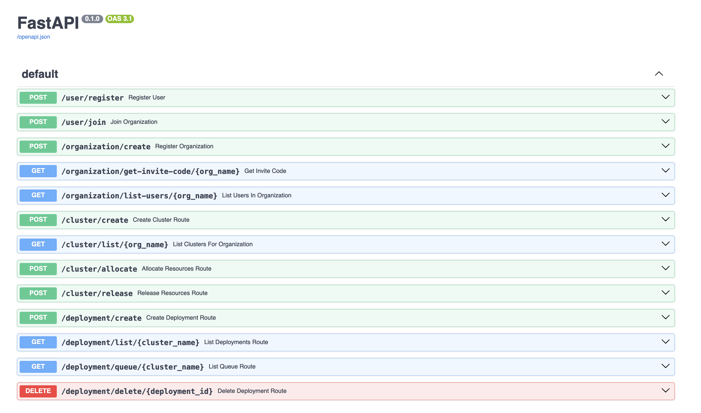
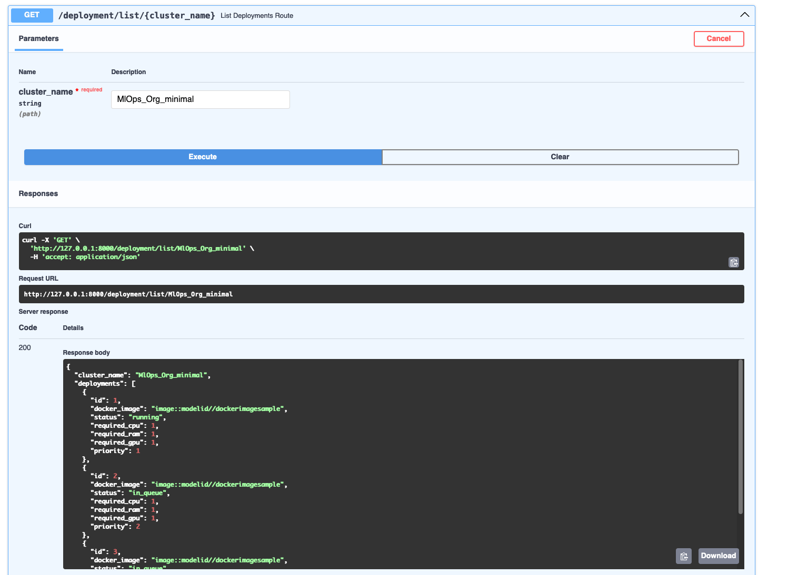
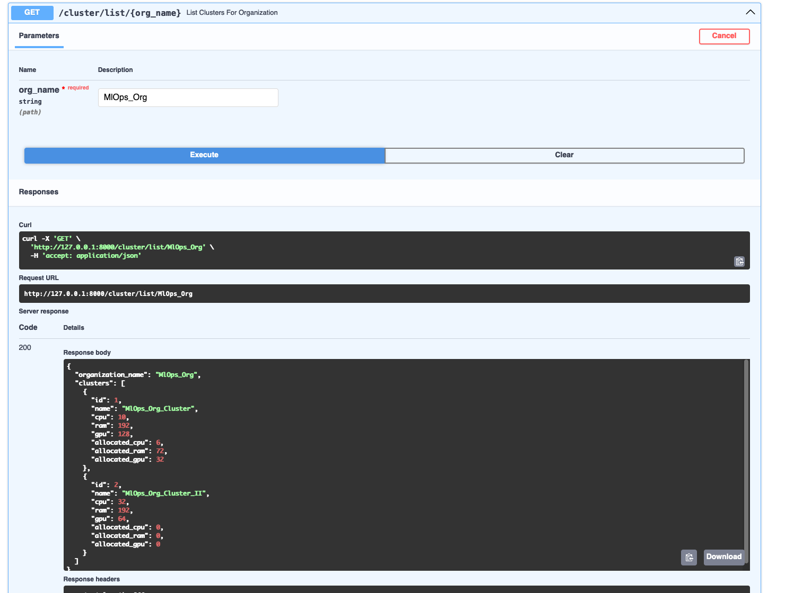
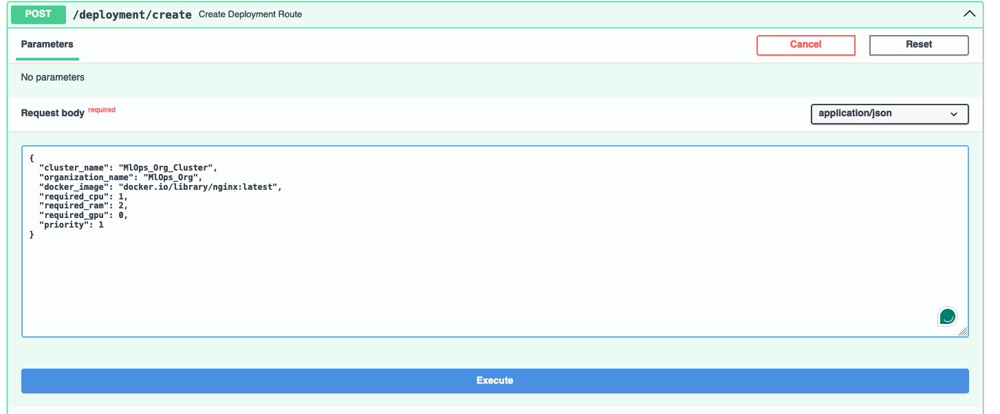

# Hypervisor

## Overview: Hypervisor
This application is designed to manage organizations, users, and deployments efficiently. It features a modular design, RESTful API architecture, and robust backend services to handle diverse tasks related to user, organization and deployment management in a cluster.

## Prerequisites

Before you start, ensure you have the following installed on your system:

- Python 3.8 or later
- pip (Python package manager)

## Installation

Follow these steps to set up the application:

1. **Clone the Repository**:
   ```bash
   git clone <repository-url>
   cd <repository-name>
   ```

2. **Create a Virtual Environment**:
   ```bash
   python -m venv venv
   source venv/bin/activate   # On Windows, use `venv\Scripts\activate`
   ```

3. **Install Dependencies**:
   ```bash
   pip install -r requirements.txt
   ```

4. **Run the Application**:
   ```
   uvicorn main:app --reload
   ```
   OR
   ```
   python main.py
   ```

To Run Tests use this command in root directory : `venv/bin/python -m pytest tests/`

**Note:** For Better API Endpoints Doc, refer : http://127.0.0.1:8000/docs (FastAPI)

## API Endpoints

### User Routes
- `POST /user/register`: Create a new user
- `POST /user/join`: Allow User to Join Org with Invite Code

### Organization Routes
- `POST /organization/create`: Create a new organization
- `GET /organization/get-invite-code/{org_name}`: Retrieve an organization Generated Invite Code
- `GET /organization/list-users/{org_name}`: List Users in an Organization

### Cluster Routes
- `POST /cluster/create`: Create a new cluster
- `GET /cluster/list/{org_name}`: List clusters for organization
- `POST /cluster/allocate`: Allocate resources for a cluster
- `POST /cluster/release`: Release cluster resource

### Deployment Routes
- `POST /deployment/create`: Create a new deployment in a cluster
- `GET /deployment/list/{cluster_name}`: List Deployments in a cluster
- `DELETE /deployment/delete/{deployment_id}`: Delete a deployment in cluster
- `GET /deployment/queue/{cluster_name}`: List Queue Status/Elements

<br>
Flow of Application :



## Application Functionality

### Entry Point: `main.py`
The application begins execution in `main.py`. This file initializes the application, sets up routes, and runs the server. It integrates all major modules to provide a seamless experience.

### Major Modules

1. **`schemas.py`**
   - Contains data validation and serialization schemas for API endpoints.
   - Ensures request and response payloads are consistent.

2. **`database.py`**
   - Manages database connections and ORM models.
   - Provides utility functions for database operations.

3. **`utils.py`**
   - Includes helper functions and utilities used across the application.
   - Simplifies repetitive tasks and error handling.

4. **`services.py`**
   - Contains business logic for various operations.
   - Acts as a bridge between controllers and database operations.

5. **Routes**:
   - `organization_routes.py`: Handles endpoints for organization-related operations.
   - `user_routes.py`: Manages user-specific API endpoints.
   - `deployment_routes.py`: Facilitates deployment-related functionalities.
   - `cluster_routes.py`: Operates on cluster-related features.

6. **`models.py`**
   - Defines database models and relationships.
   - Acts as the backbone of data storage.

## Screenshots : Working









